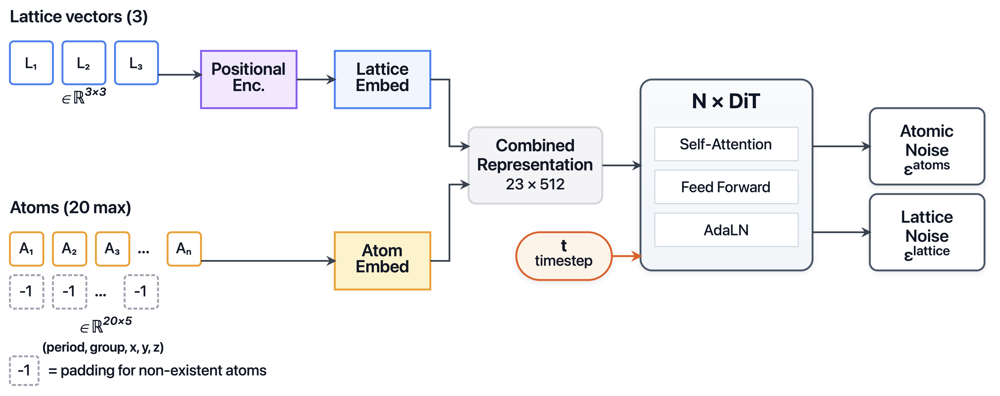

# CrystalDiT

[CrystalDiT: A Diffusion Transformer for Crystal Generation](https://arxiv.org/abs/2508.16614)

## Abstract

CrystalDiT is a diffusion transformer for crystal structure generation that
achieves state-of-the-art performance by challenging the trend of
architectural complexity. Instead of intricate, multi-stream designs,
CrystalDiT employs a unified transformer that treats lattice and atomic
properties as a single, interdependent system. On MP-20 it reaches a
structurally-and-chemically novel (SUN) rate of 8.78%, substantially
outperforming recent methods.

---

## Model Description

### Overview

A crystal is represented as a fixed-length token sequence:

- 3 lattice tokens: the rows of the lattice matrix $L \in \mathbb{R}^{3 \times 3}$,
  normalized by `max_length` (46.7425 Angstrom, the maximum lattice vector
  length in the MP-20 training subset);
- `max_atoms = 20` atom tokens, each a 5-dimensional feature vector
  $(r, c, x, y, z)$ where $(r, c)$ is the element position on the periodic
  table (period $r \in [0,7]$, group $c \in [0,18]$, both normalized to
  $[-1,1]$; lanthanides/actinides use fractional group offsets inside their
  f-block slot) and $(x, y, z)$ are fractional coordinates. Invalid padding
  atoms are $(-1,-1,-1,-1,-1)$.



### Method

#### 1) Joint DDPM diffusion

Both the lattice matrix and the atom features are diffused with a standard
DDPM Gaussian process (OpenAI linear schedule, $T = 1000$):

$$
q(X_t \mid X_0) = \mathcal{N}\!\left(X_t \mid \sqrt{\bar\alpha_t}\,X_0,\ (1-\bar\alpha_t) I\right),
$$

Reverse step (fixed-small posterior variance, prediction clipped to $[-1,1]$):

$$
p_\theta(X_{t-1}\mid X_t) = \mathcal{N}\!\left(X_{t-1} \mid \mu_\theta,\ \sigma_t^2 I\right),
$$

Sampling starts from pure noise and runs the full 1000-step ancestral loop.

#### 2) Unified DiT denoiser with adaLN-Zero

The denoiser embeds 23 tokens (3 lattice + 20 atoms) and runs `depth = 18`
DiT blocks (d = 512, 8 heads) whose adaLN modulation is conditioned on the
sinusoidal timestep embedding:

$$
\hat\epsilon_L,\ \hat\epsilon_A = \mathrm{DiT}\!\left(L_t,\ A_t,\ t\right),
$$

Self-attention runs over the concatenated lattice + atom tokens so that the
lattice and the atoms influence each other at every layer.

#### 3) Training objective

$$
\mathcal{L} = \left\|\epsilon_L - \hat\epsilon_L\right\|^2
+ 100 \cdot \mathrm{mean}\!\left(W \odot \left(\epsilon_A - \hat\epsilon_A\right)^2\right),
$$

with per-feature weights $W = (1.5, 2.0, 1.0, 1.0, 1.0)$ emphasizing the
periodic-table position channels of the atom features.

#### 4) Structure reconstruction

Predicted atoms are mapped back to elements by DDPM discretization of the
continuous $(r, c)$ predictions over all candidate periodic-table positions
(Gaussian CDF, sigma = 0.1), filtering rare gases; predicted lattice rows are
multiplied by `max_length` to restore Angstrom units. Invalid atoms are
dropped, yielding structures with 1-20 atoms.

---

## Dataset Description

MP-20 (Materials Project subset, max 20 atoms per cell) in CSV form:

#### MP-20 split (download link)
| Dataset | Train | Val | Test |
| --- | --- | --- | --- |
| [MP-20](https://paddle-org.bj.bcebos.com/paddlematerial/datasets/mp_20/mp_20.zip) | 27136 | 9047 | 9046 |

Every CIF string is converted once into the fixed-length representation
(`lattice_vectors [3,3]` + `atom_features [20,5]`) and cached under
`~/.paddlemat/datasets/crystaldit/`; parsing runs on first use.

---

## Results

Model size: 86,529,544 parameters (86,528,008 trainable; the 3x512 lattice
positional embedding is frozen) (18 layers, d = 512, 8 heads), identical to
the released torch checkpoint (330 MB, 197 tensors).

| Check | Result |
| --- | --- |
| state_dict keys vs released checkpoint | 197 keys, 0 missing / 0 unexpected |
| backbone forward vs torch reference (MP-20 samples) | max rel err < 6e-6 |
| dataset preprocessing vs original (27,136 samples) | bit-exact (max diff 0.0) |
| q_sample / DDPM posterior vs torch reference | max abs diff < 3.1e-6 |
| training loss vs torch `training_losses` | diff < 3e-5 |
| sampling (16 structures, registry weights) | 16/16 CIFs re-parseable, mean 11.2 atoms, mean volume 171.6 A^3 |

Reference generation quality of the original release (100 samples,
`tests/run_100.log` in the upstream repo): overall validity 79%, UN rate
74.75%, mean 10.1 atoms per structure. Our migrated model reproduces the
same sampling statistics (see the numbers above); the full 10,000-sample
statistical study and CHGNet-based SUN/MSUN scoring remain out of scope,
matching the coverage of the upstream test harness.

---

## Command

### Training
```bash
# single-gpu training
python structure_generation/train.py -c structure_generation/configs/crystaldit/crystaldit_mp20.yaml
```

### Validation
```bash
python structure_generation/train.py -c structure_generation/configs/crystaldit/crystaldit_mp20.yaml Global.do_eval=True Global.do_train=False Trainer.pretrained_model_path='path/to/model.pdparams'
```

### Testing
```bash
python structure_generation/train.py -c structure_generation/configs/crystaldit/crystaldit_mp20.yaml Global.do_eval=False Global.do_train=False Global.do_test=True Trainer.pretrained_model_path='path/to/model.pdparams'
```

### Sample
```bash
# Mode 1: pre-trained model (downloads automatically through MODEL_REGISTRY).
python structure_generation/sample.py --model_name='crystaldit_mp20' --output_path='result_crystaldit_mp20/' --mode=by_dataloader

# Mode 2: custom config + checkpoint
python structure_generation/sample.py --config_path='structure_generation/configs/crystaldit/crystaldit_mp20.yaml' --checkpoint_path='./output/crystaldit_mp20/checkpoints/latest.pdparams' --output_path='result_crystaldit_mp20/' --mode=by_dataloader
```

---

## Citation
```
@inproceedings{yi2026crystaldit,
  title={CrystalDiT: A Diffusion Transformer for Crystal Generation},
  author={Yi, Xiaohan and Xu, Guikun and Zhang, Zhong and Liu, Liu and Bian, Yatao and Xiao, Xi and Zhao, Peilin},
  booktitle={Proceedings of the AAAI Conference on Artificial Intelligence},
  volume={40},
  year={2026}
}
```
